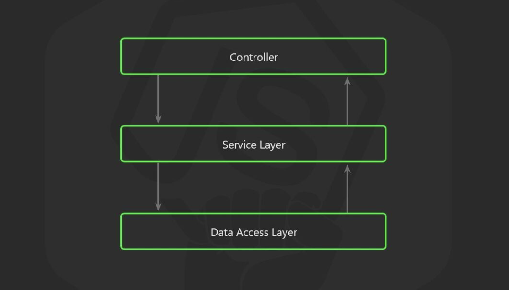

# 4주차 Node.js   스터디 내용

db를 연동하고, 간단한 crud 모델을 3계층 레이어를 적용하여 만들었습니다.

## 1. Prisma ORM을 사용한 db 연동

객체와 관계형 데이터베이스를 자동으로 맵핑시켜 쉽게 사용가능하게하는 ORM 중 Prisma를 사용하여 db를 연동했습니다.

## 2. 3계층 Layer 적용

저번 주 과제에서 부터 좀 더 지나치게 자유로운 노드의 폴더 구조를 어떻게 하면 효율적으로 정리가 가능한지 고민했습니다.

구글링을 통해 [이 블로그](https://charming-kyu.tistory.com/16)를  읽고, 스프링에서와 비슷하게 3계층의 레이어로 프로젝트를 구성해보았습니다.

- `src` dir
    - index.ts : app 진입점
    - `router` dir(api ) : 클라이언트의 요청을 라우팅 해주는 역할
    - `controller` dir : 라우팅 받은 클라이언트의 요청과 서비스로직에서의 결과값을 매치해 전달해주는 역할
    - `service` dir : 모든 비즈니스 로직

으로 폴더를 구분했는데, 여기서 주의 할 점은

- **비즈니스 로직을 api router 로직과 분리**
- **비즈니스 로직을 controller와 분리**
- **비즈니스 로직은 서비스 로직으로 분리**

이 세 가지 입니다.